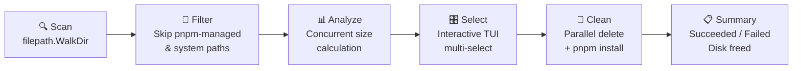

# NmodCleaner

<div align="center">

[](https://github.com/Mahmoud-s-Khedr/node_cleaner/actions/workflows/ci.yml)
[](https://go.dev)
[](LICENSE)
[](https://github.com/Mahmoud-s-Khedr/node_cleaner/stargazers)

**A blazing-fast, memory-efficient CLI tool that finds bloated `node_modules` across your projects, lets you interactively pick which ones to clean, and reinstalls dependencies via [pnpm](https://pnpm.io) — migrating your workspace to a shared global store.**

[Installation](#installation) · [Usage](#usage) · [How It Works](#how-it-works) · [Contributing](#contributing)

</div>

---

## Why NmodCleaner?

If you maintain dozens of Node.js projects, `node_modules` can silently consume tens of GBs. Cleaning them manually is tedious and error-prone.

NmodCleaner was originally rewritten in **Go** after encountering `heap out of memory` errors when scanning large filesystems with a JavaScript-based tool. It uses Go's `filepath.WalkDir` for constant-memory traversal and goroutines for concurrent disk-usage analysis.

---

## ✨ Features

| Feature | Details |
|---|---|
| 🔍 **Memory-safe scanning** | `filepath.WalkDir` traversal — no RAM hoarding, graceful permission skips |
| ⚡ **Concurrent analysis** | Goroutines calculate `node_modules` sizes in parallel |
| 🎛️ **Interactive TUI** | Beautiful multi-select checklist powered by [charmbracelet/huh](https://github.com/charmbracelet/huh), sorted by disk usage |
| 🧪 **Dry-run mode** | Preview deletions and space savings before touching anything |
| 📦 **Multi-manager support** | Auto-detects `pnpm`, `yarn`, or `npm` per project via lock files |
| 🚀 **Parallel cleanup with progress** | Live per-project Bubbletea progress TUI during concurrent delete + reinstall |
| 🛡️ **Safe path filtering** | Skips hidden dirs, `dist/`, `build/`, and system paths (`/usr/lib`, `/snap/`, etc.) |
| ⚙️ **Config file** | Persist a project skip-list in `~/.nmodcleanerrc` |
| 📊 **Stats history** | Track and display cumulative disk space freed with `--history` |

---

## 🖥️ Demo

```
$ nmod-cleaner --path ~/projects

⠸ Scanning for node_modules in /home/user/projects...
✔ Found 6 node_modules directories.
⠼ Analyzing disk usage...
✔ Analysis complete.

  Select node_modules directories to clean and migrate to pnpm:

  > [✓] ~/projects/frontend-app         (512.30 MB)
    [✓] ~/projects/api-service          (341.75 MB)
    [✓] ~/projects/legacy-dashboard     (289.10 MB)
    [ ] ~/projects/shared-utils          (47.20 MB)

  ↑/↓ navigate  space select  enter confirm

--- Summary ---
Directories Cleaned: 3
Disk Space Freed:    1.14 GB
```

---

## 🏗️ Built With

- **[Go](https://go.dev)** — Core language; chosen for performance and low memory footprint
- **[Cobra](https://github.com/spf13/cobra)** — CLI framework for flag parsing and command structure
- **[charmbracelet/huh](https://github.com/charmbracelet/huh)** — Terminal forms and interactive multi-select UI
- **[charmbracelet/bubbletea](https://github.com/charmbracelet/bubbletea)** — Live per-project progress TUI
- **[charmbracelet/lipgloss](https://github.com/charmbracelet/lipgloss)** — Rich terminal styling (colors, bold, icons)
- **[briandowns/spinner](https://github.com/briandowns/spinner)** — Animated progress spinners

---

## Prerequisites

- [Go](https://go.dev/dl/) >= 1.22
- [pnpm](https://pnpm.io/installation) installed and available in your `PATH`

---

## Installation

**Using `go install`:**

```bash
go install github.com/Mahmoud-s-Khedr/node_cleaner@latest
```

**Build from source:**

```bash
git clone https://github.com/Mahmoud-s-Khedr/node_cleaner.git
cd node_cleaner
go build -o nmod-cleaner .
sudo mv nmod-cleaner /usr/local/bin/
```

---

## Usage

Navigate to any directory containing multiple Node.js projects and run:

```bash
nmod-cleaner
```

Or point it at a specific path:

```bash
nmod-cleaner --path /path/to/your/projects
```

### Dry Run

Preview what would be removed and how much space you would reclaim — without deleting anything:

```bash
nmod-cleaner --dry-run
```

### Options

| Flag | Short | Default | Description |
|------|-------|---------|-------------|
| `--path` | `-p` | current directory | Directory to scan for `node_modules` |
| `--dry-run` | `-d` | `false` | Simulate execution, print space savings |
| `--config` | | `~/.nmodcleanerrc` | Path to config file with project skip-list |
| `--history` | | | Print cumulative stats history and exit |
| `--help` | `-h` | | Display help |

### Config File

Create `~/.nmodcleanerrc` (JSON) to permanently skip specific project paths:

```json
{
  "skipPaths": [
    "/home/user/work/dont-touch-this",
    "/home/user/archived-projects"
  ]
}
```

Paths support both exact matches and prefix matches, so a directory and all its subdirectories can be skipped at once.

### Stats History

After each run, stats are automatically saved to `~/.nmod-cleaner-history.json`. View your cumulative totals:

```bash
nmod-cleaner --history
```

```
--- Stats History ---
Date                            Cleaned   Failed        Freed
─────────────────────────────────────────────────────
2026-03-05 10:12:04                   3        0      1.14 GB
2026-03-05 14:30:21                   5        1      2.80 GB
─────────────────────────────────────────────────────
TOTAL (2 runs)                        8        1      3.94 GB
```

---

## How It Works



1. **Scan** — Recursively walks the target directory, skipping hidden directories, `dist/`, `build/`, and system paths (`/usr/lib`, `/snap/`, etc.)
2. **Filter** — Removes any `node_modules` already managed by pnpm (detected via `.modules.yaml` or `pnpm-lock.yaml` in the parent project)
3. **Analyze** — Calculates disk usage for each candidate concurrently using goroutines
4. **Select** — Presents an interactive checklist sorted by size (largest first), with all entries pre-selected
5. **Clean** — Deletes selected `node_modules` directories and runs `pnpm install` in each project in parallel
6. **Summary** — Reports a per-run summary of successes, failures, and total disk space freed

---

## 📁 Project Structure

```
node_cleaner/
├── main.go                   # Entry point
├── cmd/
│   └── root.go               # CLI command definition, flag wiring, orchestration
└── internal/
    ├── scanner/
    │   └── scanner.go        # Filesystem traversal, package manager detection, path filtering
    ├── analyzer/
    │   └── analyzer.go       # Concurrent disk-usage calculation, byte formatting
    ├── cleaner/
    │   └── cleaner.go        # node_modules deletion
    ├── installer/
    │   └── installer.go      # npm / yarn / pnpm install execution
    ├── config/
    │   └── config.go         # .nmodcleanerrc loader and project skip-list
    ├── history/
    │   └── history.go        # Append-only run history and cumulative stats
    └── ui/
        └── prompt.go         # TUI prompt (huh), Bubbletea progress view, lipgloss styles
```

---

## Known Limitations

- On Windows, `pnpm`, `npm`, and `yarn` must be installed and available in `PATH` as their `.cmd` wrappers
- Cross-platform path handling is tested on Linux and macOS; Windows CI is provided via GitHub Actions

---

## 🗺️ Roadmap

All planned features from the initial roadmap have been implemented:

| # | Feature | Status |
|---|---|---|
| 1 | **npm / yarn support** | ✅ Implemented |
| 2 | **Progress bars** | ✅ Implemented |
| 3 | **Windows support** | ✅ Implemented |
| 4 | **Config file** | ✅ Implemented |
| 5 | **Stats history** | ✅ Implemented |

> Have a new idea? [Open an issue](https://github.com/Mahmoud-s-Khedr/node_cleaner/issues) or see [CONTRIBUTING.md](CONTRIBUTING.md).

---

## Contributing

Contributions are welcome! Please see [CONTRIBUTING.md](CONTRIBUTING.md) for details.

---

## 👤 Author

**Mahmoud Khedr**  
GitHub: [@Mahmoud-s-Khedr](https://github.com/Mahmoud-s-Khedr)

---

## License

[MIT](LICENSE)

---

<div align="center">
  If you find this tool useful, please consider giving it a ⭐ — it helps others discover the project!
</div>
